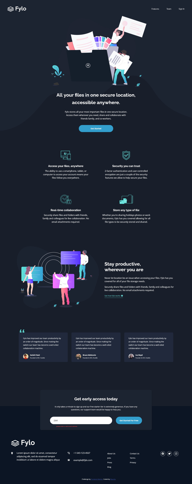

# Frontend Mentor - Fylo dark theme landing page solution

This is a solution to the [Fylo dark theme landing page challenge on Frontend Mentor](https://www.frontendmentor.io/challenges/fylo-dark-theme-landing-page-5ca5f2d21e82137ec91a50fd). Frontend Mentor challenges help you improve your coding skills by building realistic projects. 

## Table of contents

- [Overview](#overview)
  - [The challenge](#the-challenge)
  - [Screenshot](#screenshot)
  - [Links](#links)
- [My process](#my-process)
  - [Built with](#built-with)
  - [What I learned](#what-i-learned)
  - [Continued development](#continued-development)
  - [Useful resources](#useful-resources)
- [Author](#author)

## Overview

### The challenge

Users should be able to:

- View the optimal layout for the site depending on their device's screen size
- See hover states for all interactive elements on the page

### Screenshot




### Links

- Solution URL: [solution URL here](https://www.frontendmentor.io/solutions/fylo-dark-theme-landing-page-TJU38jRRX1)
- Live Site URL: [live site URL](https://mauritzlm.github.io/Fylo-dark-theme/)

## My process

### Built with

- Semantic HTML5 markup
- CSS custom properties
- Flexbox
- CSS Grid
- Mobile-first workflow

### What I learned

Using align self on a flex item is a handy way to position the item. Below I use align self to center the wrapping div of the input and button elements in the form.

```css
form div {
    align-self: center;
}
```

### Continued development

I want to continue building web pages to improve my layout skills. 

### Useful resources

- [css tricks grid article](https://css-tricks.com/snippets/css/complete-guide-grid/) - A very helpful resource when working with css grid.

## Author

- Frontend Mentor - [@MauritzLM](https://www.frontendmentor.io/profile/MauritzLM)


